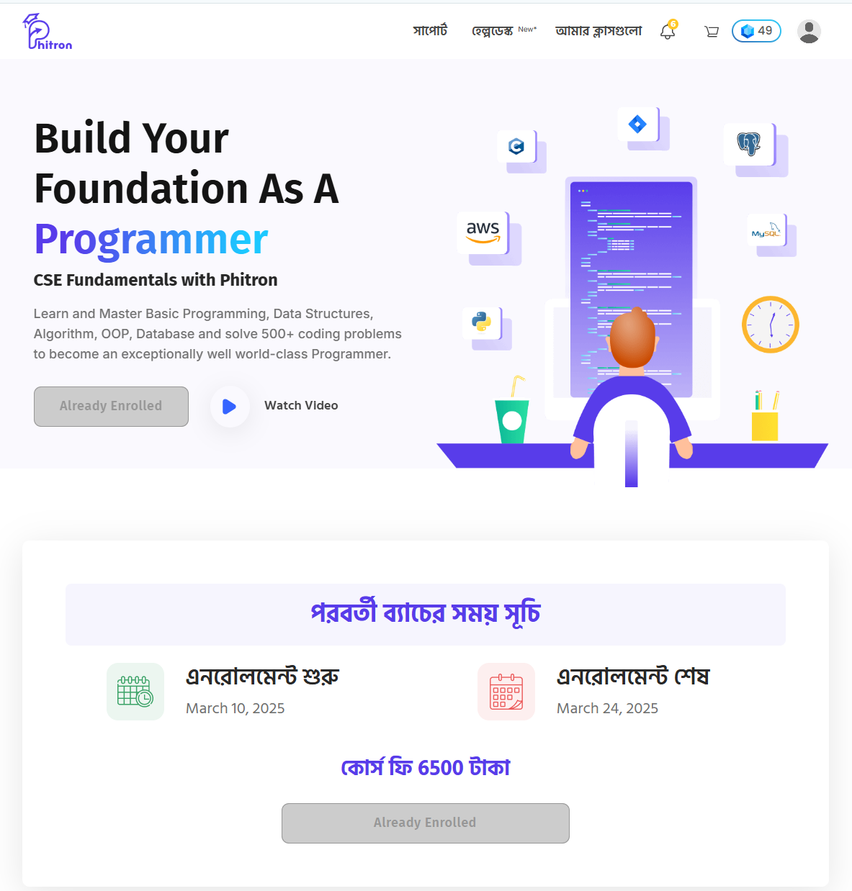

# 🚀 Getting Started

The repository contains C/C++ implementation of different data structures and algorithms problems' solutions. This is based on Phitron's course titled [**CSE Fundamentals with Phitron**](https://phitron.io/). 

---



## 📚 Course Overview

Learn and Master Basic Programming, Data Structures, Algorithm, OOP, Database and solve 500+ coding problems to become an exceptionally well world-class Programmer.

# 🌟 Key Features

- **Language Diversity:** Solutions are implemented in C/C++ programming languages.
- **Well-Commented Code:** Most of the files include comments explaining the algorithm and its implementation.
- **Beginner Friendly:** This starts with the basic of C programming and slowly delves deep into the fundamentals of C progframming, data structures, algorithms, OOPs, database and then will deep dive into problem solving.

---

# 📝 Contributing

Contributions are welcome! If you'd like to contribute:

1. **Fork the repository.**
   ```
   git clone https://github.com/shammun/phitron_cse_fundamentals.git
   ```
2. **Create a new branch:**
   ```bash
   git checkout -b feature/your-feature-name
   ```
3. **Commit your changes:**
   ```bash
   git commit -m "Add new feature: your feature name"
   ```
4. **Push the changes:**
   ```bash
   git push origin feature/your-feature-name
   ```

---

# 📧 Contact

For any questions or suggestions, feel free to reach out via:
- **Email:** [sha_is13@yahoo.com](mailto:sha_is13@yahoo.com)
- **GitHub Issues:** [Create an issue](https://github.com/shammun/phitron_cse_fundamentals/issues)

---

